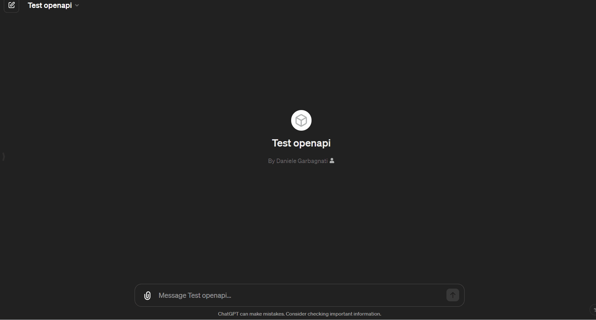
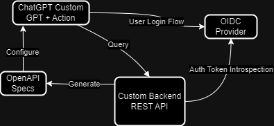

# neuro-rs
Neuro-rs is a repository used to experiment with OpenAI GPTs, in particular integration and authentication with actions.
Instead of using GPT API from your application, by deploying your application with OpenAPI and Oauth2 authentication, you can expand and personalize the capabilities of your GPT-4 bots.
The logic part is a simple "todo app" taken from an example in "utoipa" crate. It can be substituted with anything you want your GPT to be able to do. It will feed on the resulting OpenAPI schema generated by the application.

# Important notes and limitations
- Custom GPT actions feature is only available to ChatGPT subscribers. Since it uses GPT-4, the integration is subject to the 40 calls / 3 hours limit.
- The setup of this project is meant to run on ARM64 workloads (in particular the Dockerfile and the deploy Github Actions workflow) but can be easily adapted to support other targets
- This integration has been developed by authenticating against an existing Keycloak instance. It should still be compatible with other OIDC authentication providers, but it hasn't been tested yet.
- Swagger-UI can be found on the "/swagger-ui" path after startup. Same goes for "/api-docs/openapi.json" which contains OpenAPI specs. These are currently exposed on the public router of the web-server.

# .env Configuration
In order to execute the application correctly, substitute the values in ".env.example" file with your keycloak configuration and rename the file as ".env"

# Project Roadmap

This roadmap outlines the current and planned features. Checked items represent features that are already implemented.

###  Core Features
- [X] **REST API web server**: Expose logic via REST API on a web server (Axum). 
- [X] **OpenAPI specs**: OpenAPI specs allow us to integrate seemlessly with ChatGPT (utoipa). 
- [X] **Authentication middleware**: Endpoints are protected with Keycloak as Authentication server using Oauth2 and OpenIDConnect. 
- [X] **SwaggerUI with authorization setup**: SwaggerUI playground is available and setup for authorization workflows. 
- [X] **Configuration management**: Configurations can be set via environment variables following rust best practises.
- [ ] **Unit testing**: Obtain (and keep) unit tests full code coverage.
- [ ] **Bulk endpoints**: Offer bulk CRUD endpoints in order to reduce the number of calls needed by GPT for a complex task.
- [ ] **Advanced search endpoint**: Offer a more complex and meaniningful search endpoint.
- [ ] **Persistence**: Create a persistence layer so that objects are kept between application restarts (currently saved in memory, probably on postgres with this change).
- [ ] **Authorization guard**: Endpoints can be protected so that only authorized users (with a specific role) can access.

---

This roadmap is subject to change and will be updated as the project evolves. Your contributions and suggestions are always welcome!

## Disclaimer

This Rust project is made for educational purposes.

If you have any suggestions or tips on what should be added, please feel free to reach out.

# Development

## Tarpaulin for Test Coverage

### Introduction to Tarpaulin

[Tarpaulin](https://github.com/xd009642/tarpaulin) is a code coverage tool specifically designed for Rust projects. It helps in assessing the effectiveness of tests by reporting the percentage of code executed during testing.

### Setting Up Tarpaulin

To use Tarpaulin in this project:

1. Ensure you have Rust and Cargo installed.
2. Install Tarpaulin by running `cargo install cargo-tarpaulin`.

### Running Tarpaulin

Execute your tests with Tarpaulin by using the command `cargo tarpaulin`. This will run your test suite and provide a coverage report upon completion.

## GitHub Actions for Build and Test on Pull Requests

### About GitHub Actions

GitHub Actions automate workflows directly in your GitHub repository. For this template, we use Actions to build and test the codebase whenever a new pull request (PR) is made.

### Configuring the Workflow

The `.github/workflows/rust_build_and_test.yml` file contains the workflow configuration. It's set up to trigger on pull requests, executing the build and test processes.

### Workflow Steps

The workflow includes the following steps:

1. Set up the Rust environment.
2. Cache dependencies to speed up builds.
3. Build the project.
4. Run tests.

